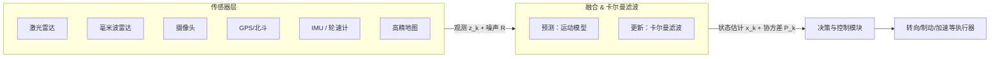

# 卡尔曼滤波通俗讲解：智能汽车的传感器融合实战

> 适用人群：对自动驾驶/智能车感兴趣的工程师与学生；希望把“传感器融合 + 定位/跟踪”真正落地的开发者。

**摘要**
- 传感器融合用来综合不同来源的观测，提升稳定性与精度；卡尔曼滤波是线性高斯场景下的“最优融合器”。
- 用“一室两温度计”的故事引入加权平均思想，再把加权平均搬到时间轴上（预测 + 更新）。
- 给出一维卡尔曼的核心公式与直觉，扩展到多维与多传感器的工程实践。
- 结合智能汽车的“高精定位”和“目标跟踪”，说明卡尔曼滤波在哪里发光，以及冲突观测如何处理。
- 附可运行的 Python 1D Demo 与 Mermaid 信息流心智图，便于快速上手与复习。

**关键词**
- `卡尔曼滤波`、`传感器融合`、`智能汽车`、`高精定位`、`目标跟踪`、`Mermaid`、`Python`

---

## 为什么需要传感器融合

LLM 与自动驾驶不同，但“信息不完美”是共性：任何单一传感器都会受环境与物理机制限制。

- 复杂场景下单一观测不可靠（雨雪雾、遮挡、光线变化）。
- 不同传感器优势互补（雷达抗干扰、视觉识别强、地图绝对位置准）。
- 工程目标是“更稳、更准、连续”，而不是“某一帧特别准”。

把多源观测融合成一个“最靠谱”的状态估计，就是传感器融合的核心；在线性高斯假设下，卡尔曼滤波给出最优解。

---

## 主流传感器简述

### 激光雷达（LiDAR）
- 原理：发射激光 → 反射 → 计算距离与方向，形成 3D 点云。
- 优点：距离/形状精度高，适合空间建模；不依赖环境光。
- 缺点：雨雪雾易衰减；看不到颜色；成本相对较高。

### 毫米波雷达（Radar）
- 原理：发射毫米波电磁波，利用多普勒效应获取相对速度。
- 优点：对距离与相对速度敏感；全天候、可穿透雨雪雾。
- 缺点：分辨率低，轮廓不清；同样不感知颜色与纹理。

### 摄像头（Camera）
- 原理：接收环境光形成图像。
- 优点：能看到颜色/纹理/形状；配合深度学习可识别丰富语义（红绿灯、车道线、行人等）。
- 缺点：弱光/逆光受影响；单目测距不精；双目测距精度有限且受视场/基线限制。

### 高精地图 + 高精定位（HD Map + Localization）
- 普通导航：误差米级，难区分车道级细节。
- 高精地图：分米/厘米级，把车道线、路缘、标志牌等精细建模。
- 高精定位：GNSS → 差分 → 传感器与地图匹配收敛到更高精度。

---

## 两个温度计的故事：加权平均的直觉

你用两只温度计测房间温度：
- A：测得 `Z1 = 25℃`，方差 `σ1² = 1`（更准）。
- B：测得 `Z2 = 28℃`，方差 `σ2² = 9`（更不准）。

最优估计不是简单平均，而是“按精度加权”的加权平均：

`w = (1/σ1²) / [(1/σ1²) + (1/σ2²)] = 0.9`

于是：`T̂ = 0.9 × 25 + 0.1 × 28 = 25.3℃`，整体方差小于任意单一观测。

卡尔曼滤波做的事之一，就是把这种“按置信度加权”的直觉系统化。

---

## 把加权平均搬到时间轴：卡尔曼滤波骨架（1D）

现实里状态随时间变化（t = 1, 2, 3…）。每一步都做两件事：
- 预测（Predict）：根据上一时刻状态与模型，给出“此刻大概在哪”。
- 更新（Update/Correct）：用新的观测来修正预测。

一维简化形式（只看位置）：

```
x_pred = x
P_pred = P + Q          # 过程噪声 Q：模型不完美

K = P_pred / (P_pred + R)          # 卡尔曼增益（0~1）
x = x_pred + K * (z - x_pred)      # 观测 z 修正预测
P = (1 - K) * P_pred               # 更新不确定性
```

直觉：
- R 很小（观测准）→ K 接近 1 → 更信观测。
- P_pred 很小（模型准）→ K 接近 0 → 更信预测。

---

## 多维与多传感器版本（工程视角）

把一维数值扩展为向量与矩阵：
- 状态向量：`x = [x, y, vx, vy, heading, yaw_rate, …]^T`
- 预测：`x_k^- = F x_{k-1} + B u_k + w_k`
- 观测：`z_k = H x_k + v_k`
- 协方差与增益也从标量扩展为矩阵，流程不变：预测 → 计算增益 → 更新。

多传感器融合两种常见方式：
- 一次性打包为大观测向量 `z` 做一次更新。
- 在同一时间步按顺序多次更新（GPS → IMU → 轮速计…）。

---

## 在智能汽车中的两个典型场景

### 1) 高精定位
- 用 IMU/轮速等短期稳定的传感器做“预测”。
- 用 GNSS/地图匹配等长期稳定的信息做“纠偏”。
- 隧道场景：GPS 几乎失效 → 依赖 IMU/轮速预测；出隧道后重新融入 GNSS/地图匹配，修正累计误差。
- 决策模块根据不确定性 `P` 判断是否安全执行变道/超车。

### 2) 目标跟踪与环境建模
- 每个目标有自己的状态向量（位置、速度、加速度…）。
- 摄像头、雷达、LiDAR 的观测映射到同一状态空间，按各自噪声（方差）分配权重。
- 即便短时遮挡，也能“凭惯性”跟踪；再次出现时自然融回，不把它当新目标。

---

## 冲突观测如何处理：权重与鲁棒性

- 每个传感器带着自己的方差（置信度）参与融合；环境变化可动态调整权重（雨雪天提升雷达权重、好天气提升视觉权重）。
- 如果残差（观测 - 预测）异常大，可做离群处理/降权；工程上常在卡尔曼外再包鲁棒机制。
- 结果不是“听一家”，而是“加权投票”的连续答案。

---

## GPS 方差从哪里来？如何构造测量协方差 R（高德 SDK 场景）

很多 SDK 不直接给“方差”，但会给“水平精度（accuracy，单位米）”这类指标。工程实践中可以这样把它转成测量噪声协方差 `R`：

- 如果能获取 `accuracy_m`（如 Android `Location.getAccuracy()`、高德 `AMapLocation.getAccuracy()`、iOS `CLLocation.horizontalAccuracy`）：
  - 近似认为它就是位置的 1σ 水平误差，记 `σ_pos = accuracy_m`，则位置测量协方差可设为 `R_pos = diag([σ_pos^2, σ_pos^2])`。
- 如果拿不到精度字段：
  - 用场景常量做启发式。城市道路 `σ_pos ≈ 5–10 m`；开阔郊外 `σ_pos ≈ 3–5 m`；RTK/DGNSS `σ_pos ≈ 0.1–0.3 m`。

航向角（heading）通常没有精度字段，也可以按速度做启发式：
- 低速/停车（`speed < 1 m/s`）：`σ_heading ≈ 15–30°`（换算为弧度后再平方用到 `R`）。
- 正常行驶（`speed ≥ 1 m/s`）：`σ_heading ≈ 3–5°`。

此外，可根据 `AMapLocation.getLocationType()`（GPS/WiFi/基站）为不同来源设不同默认 `σ_pos`，并随天气/遮挡自适应调整权重：`accuracy_m` 变大 → 增大 `R`（降低权重）。

为了把经纬度融入到车体的本地米制坐标（如 ENU），在小范围内可用近似：
- `dx ≈ (lon - lon0) * cos(lat0) * 111320`
- `dy ≈ (lat - lat0) * 110540`
把 `(lat0, lon0)` 设为参考原点（比如起点或地图坐标原点），即可得到以米为单位的位置测量。

示例（Python 伪代码）：

```python
import math
import numpy as np

# 输入：lat, lon, heading_deg, (可选) accuracy_m, speed_mps
lat0, lon0 = 31.2304, 121.4737  # 参考原点（示例）
dx = (lon - lon0) * math.cos(math.radians(lat0)) * 111320.0
dy = (lat - lat0) * 110540.0
heading_rad = math.radians(heading_deg)

sigma_pos = accuracy_m if accuracy_m is not None else 5.0
sigma_heading_deg = 3.0 if (speed_mps is not None and speed_mps >= 1.0) else 20.0
sigma_heading = math.radians(sigma_heading_deg)

# 只融合位置：
R_pos = np.diag([sigma_pos**2, sigma_pos**2])
z_pos = np.array([dx, dy])

# 融合位置+航向（状态含 heading 时）：
R_full = np.diag([sigma_pos**2, sigma_pos**2, sigma_heading**2])
z_full = np.array([dx, dy, heading_rad])
```

无精度字段时的自适应策略（深入浅出版）：
- 残差门限：计算残差 `r = z - H x_pred` 与协方差 `S = H P_pred H^T + R`，若统计量 `r^T S^-1 r` 超过阈值（二维位置 99% 置信度约 9.21），判定离群，降低该次更新的权重或直接丢弃。
- 协方差匹配：当残差长期偏大，缓慢增大 `R`；当残差长期偏小，缓慢减小 `R`（用指数平均平滑，例如 `R <- α R + (1-α) r r^T`，`α≈0.9`）。

简要实践建议：
- 优先用 SDK 的 `accuracy` 字段直接设定 `σ_pos`，它通常就是“水平误差半径”的近似 1σ。
- 航向角用速度驱动的启发式即可满足多数车载场景，低速显著增大方差。
- 坐标系务必统一（GCJ-02/地图坐标 → 本地米制坐标），再做融合；同时保证时间戳精确对齐。

---

## 信息流心智图（Mermaid）



---

## Python 一维卡尔曼滤波 Demo（可运行）

```python
# 简单的一维卡尔曼滤波示例：用若干温度观测估计真实温度
measurements = [25, 28, 26, 27, 25]

x = 25.0   # 初始估计
P = 1.0    # 初始不确定性（方差）
Q = 0.1    # 过程噪声方差：模型不完美
R = 1.0    # 观测噪声方差：传感器精度

for z in measurements:
    # 预测
    x_pred = x
    P_pred = P + Q

    # 更新
    K = P_pred / (P_pred + R)
    x = x_pred + K * (z - x_pred)
    P = (1 - K) * P_pred
    print(f"z={z:>4} -> x={x:.2f}, K={K:.2f}, P={P:.2f}")
```

运行后你会看到：随着融合进行，`x` 趋于稳定，`P`（不确定性）逐步减小，这就是“融合更稳”的直觉体现。

---

## 工程落地清单（Checklist）

- 明确状态变量与观测模型（`x`、`F/B`、`H`、`Q/R`）。
- 配置不同传感器的噪声方差并做动态权重策略（天气/场景自适应）。
- 确保空间/时间对齐（坐标系统一、时间戳精确）。
- 打印关键调试信息（残差、增益 `K`、不确定性 `P`），快速定位异常。
- 做鲁棒性保护（离群检测、丢帧处理、重识别策略）。

---

## 小结

- 卡尔曼滤波是线性高斯场景下的最优融合器，把“谁更准就更信谁”的加权平均搬到时间轴上。
- 在智能汽车里，它支撑高精定位与目标跟踪，让系统在复杂环境下仍然稳定可靠。
