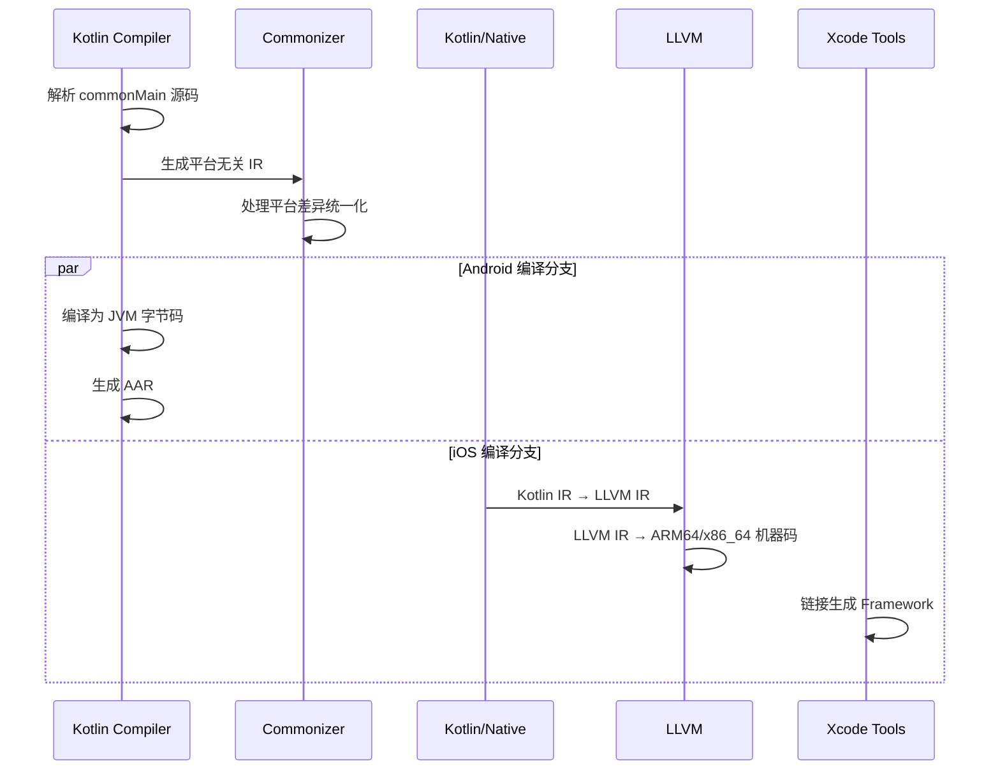

# 从0到1搭建KMP项目：让你的移动开发效率提升100%

## 项目概述

本项目是一个 Kotlin Multiplatform (KMP) 示例工程，展示了 Kotlin 跨平台编译的底层机制。与普通 Android 项目不同，KMP 项目通过 **Kotlin/Native** 和 **Commonizer** 技术实现真正的跨平台代码共享，将 Kotlin 代码编译为多个平台的原生代码。

## KMP vs 普通 Android 项目的本质区别

### 1. 编译目标差异

**普通 Android 项目：**
- 只编译为 JVM 字节码 (.class 文件)
- 运行在 Android Runtime (ART) 上
- 构建产物：APK/AAB 文件

**KMP 项目：**
- 同时编译为多个目标平台的原生代码
- Android: JVM 字节码
- iOS: LLVM IR → 原生机器码
- 构建产物：Android AAR + iOS Framework

### 2. 关键目录结构对比

```
普通 Android 项目：
app/
├── build/
│   ├── intermediates/          # Android 编译中间产物
│   └── outputs/               # APK 输出
└── src/main/kotlin/           # 单一平台代码

KMP 项目：
shared/
├── build/
│   ├── bin/                   # 🔥 多平台二进制文件
│   │   ├── iosArm64/          # iOS 真机 Framework
│   │   ├── iosSimulatorArm64/ # iOS 模拟器 Framework  
│   │   └── iosX64/            # iOS x86_64 模拟器 Framework (Intel Mac)
│   ├── classes/kotlin/        # 多平台编译产物
│   │   ├── commonizer/        # Commonizer 处理结果
│   │   ├── android/           # Android JVM 字节码
│   │   │   └── main/          # Android 主模块编译产物
│   │   ├── iosArm64/          # iOS ARM64 KLIB
│   │   ├── iosSimulatorArm64/ # iOS 模拟器 ARM64 KLIB
│   │   ├── iosX64/            # iOS x64 KLIB
│   │   └── metadata/          # 平台元数据
│   ├── libs/                  # 🔥 Android 库文件
│   │   └── shared-debug.aar   # Android AAR 包
│   ├── outputs/               # Android 输出产物
│   │   └── aar/               # AAR 文件目录
│   │       ├── shared-debug.aar
│   │       └── shared-release.aar
│   └── fat-framework/         # 通用 iOS Framework
└── src/
    ├── commonMain/            # 跨平台共享代码
    ├── androidMain/           # Android 特定实现
    └── iosMain/              # iOS 特定实现
```

## 项目结构详解

```
KMPDemo/
├── androidApp/                 # Android 应用模块
│   ├── build.gradle.kts        # Android 构建配置
│   └── src/main/
│       ├── AndroidManifest.xml # Android 清单文件
│       └── java/com/example/kmpdemo/androidApp/
│           └── MainActivity.kt  # Android 主活动
├── shared/                     # 共享模块
│   ├── build.gradle.kts        # 共享模块构建配置
│   └── src/
│       ├── androidMain/        # Android 特定代码
│       ├── commonMain/         # 跨平台共享代码
│       │   └── kotlin/
│       │       ├── Greeting.kt # 问候功能
│       │       └── Platform.kt # 平台信息
│       └── iosMain/            # iOS 特定代码
├── build.gradle.kts            # 根项目构建配置
├── settings.gradle.kts         # 项目设置
└── gradle/                     # Gradle 配置
    └── libs.versions.toml      # 版本目录
```

## 编译结果详解

### 1. 编译产物总览

KMP 项目编译后会在 `shared/build/` 目录下生成多种类型的产物：

```bash
shared/build/
├── bin/                        # 🔥 多平台二进制文件
│   ├── iosArm64/
│   │   └── debugFramework/
│   │       └── shared.framework    # iOS 真机 Framework
│   ├── iosSimulatorArm64/
│   │   └── debugFramework/
│   │       └── shared.framework    # M1 Mac 模拟器 Framework
│   └── iosX64/
│       └── debugFramework/
│           └── shared.framework    # Intel Mac 模拟器 Framework
├── classes/kotlin/             # 多平台编译中间产物
│   ├── android/
│   │   └── main/               # Android JVM 字节码 (.class)
│   ├── iosArm64/
│   │   └── main/klib/
│   │       └── shared.klib     # iOS ARM64 KLIB 文件
│   ├── iosSimulatorArm64/
│   │   └── main/klib/
│   │       └── shared.klib     # iOS 模拟器 ARM64 KLIB
│   ├── iosX64/
│   │   └── main/klib/
│   │       └── shared.klib     # iOS x64 KLIB 文件
│   ├── commonizer/             # Commonizer 处理结果
│   └── metadata/               # 平台元数据
│       ├── commonMain/
│       └── iosMain/
├── libs/                       # Android 库文件
│   ├── shared-debug.aar        # Android Debug AAR 包
│   └── shared-release.aar      # Android Release AAR 包
├── outputs/aar/                # Android 输出产物
│   ├── shared-debug.aar
│   └── shared-release.aar
├── fat-framework/              # 通用 iOS Framework
│   ├── debug/
│   │   └── shared.framework    # 包含所有架构的 Framework
│   └── release/
│       └── shared.framework
└── XCFrameworks/               # 🔥 Xcode 通用 Framework
    ├── debug/
    │   └── shared.xcframework
    └── release/
        └── shared.xcframework
```

### 2. Android 编译产物详解

#### 2.1 AAR 包结构
```bash
shared-debug.aar
├── AndroidManifest.xml         # Android 清单
├── classes.jar                 # 编译后的 Java/Kotlin 字节码
├── R.txt                       # 资源 ID 映射
├── res/                        # Android 资源文件
└── META-INF/                   # 元数据信息
```

#### 2.2 JVM 字节码
```bash
shared/build/classes/kotlin/android/main/
├── com/example/kmpdemo/
│   ├── Greeting.class          # 编译后的 Kotlin 类
│   ├── Platform.class
│   └── GreetingKt.class        # 顶级函数编译结果
└── META-INF/
    └── shared_debug.kotlin_module  # Kotlin 模块元数据
```

### 3. iOS 编译产物详解

#### 3.1 Framework 结构
```bash
shared.framework/
├── Headers/
│   ├── shared.h                # Objective-C 头文件
│   └── shared-Swift.h          # Swift 桥接头文件
├── Modules/
│   ├── module.modulemap        # 模块映射文件
│   └── shared.swiftmodule/     # Swift 模块信息
│       ├── arm64-apple-ios.swiftdoc
│       ├── arm64-apple-ios.swiftinterface
│       └── arm64-apple-ios.swiftmodule
├── Info.plist                  # Framework 信息
├── shared                      # 二进制文件 (机器码)
└── _CodeSignature/             # 代码签名 (Release 版本)
```

#### 3.2 KLIB 文件详解
```bash
shared.klib
├── manifest                    # KLIB 清单文件
├── linkdata/                   # 链接数据
│   ├── module/                 # 模块信息
│   └── package_com.example.kmpdemo/  # 包结构
├── targets/                    # 目标平台信息
│   └── ios_arm64/              # iOS ARM64 特定数据
└── ir/                         # Kotlin IR 中间表示
    ├── files/                  # IR 文件
    └── symbols/                # 符号表
```

### 4. XCFramework 详解

**XCFramework** 是苹果推荐的通用 Framework 格式，支持多架构：

```bash
shared.xcframework/
├── Info.plist                  # XCFramework 信息
├── ios-arm64/                  # iOS 真机 (iPhone/iPad)
│   └── shared.framework/
├── ios-arm64_x86_64-simulator/ # iOS 模拟器 (M1 + Intel Mac)
│   └── shared.framework/
└── ios-x86_64-maccatalyst/     # Mac Catalyst (可选)
    └── shared.framework/
```

**优势对比：**
| 格式 | 支持架构 | Xcode 集成 | 分发便利性 |
|------|----------|------------|------------|
| **Framework** | 单一架构 | ✅ 原生支持 | ❌ 需要多个文件 |
| **Fat Framework** | 多架构合并 | ✅ 原生支持 | ⚠️ 可能被拒审 |
| **XCFramework** | 多架构分离 | ✅ 完美支持 | ✅ 单文件分发 |

### 6. 编译产物大小对比

| 产物类型 | Debug 版本 | Release 版本 | 说明 |
|----------|------------|--------------|------|
| **Android AAR** | ~500KB | ~200KB | 包含 JVM 字节码 + 资源 |
| **iOS Framework** | ~2MB | ~800KB | 包含原生机器码 |
| **KLIB 文件** | ~100KB | ~50KB | Kotlin IR 中间表示 |
| **XCFramework** | ~6MB | ~2.5MB | 包含所有架构的 Framework |

### 7. 编译产物的使用场景

#### Android 集成
```kotlin
// app/build.gradle.kts
dependencies {
    implementation(project(":shared"))  // 直接依赖 AAR
    // 或者
    implementation("com.example:shared:1.0.0")  // Maven 仓库
}
```

#### iOS 集成
```swift
// 1. 手动集成 Framework
// Xcode → Target → General → Frameworks, Libraries, and Embedded Content
// 添加 shared.framework

// 2. 使用 XCFramework (推荐)
// 拖拽 shared.xcframework 到 Xcode 项目

// 3. CocoaPods 集成
// Podfile
pod 'shared', :path => '../shared'
```

### 8. 编译产物验证

#### 验证 AAR 内容
```bash
# 解压 AAR 查看内容
unzip -l shared/build/outputs/aar/shared-debug.aar

# 查看 classes.jar 中的类
jar -tf shared/build/outputs/aar/shared-debug.aar | grep ".class"
```

#### 验证 Framework 架构
```bash
# 查看 Framework 支持的架构
lipo -info shared/build/bin/iosArm64/debugFramework/shared.framework/shared

# 输出: Architectures in the fat file: arm64
```

#### 验证 XCFramework 信息
```bash
# 查看 XCFramework 详细信息
xcodebuild -checkFirstLaunchStatus
plutil -p shared/build/XCFrameworks/debug/shared.xcframework/Info.plist
```

**总结**: KMP 编译产物丰富多样，每种产物都有其特定的用途和优势。理解这些产物的结构和用法，有助于更好地进行跨平台开发和集成。

## KMP 底层技术原理深度解析

### 1. Kotlin/Native 编译链

**编译流程：**
```
Kotlin 源码 → Kotlin IR → LLVM IR → 平台原生代码
```

### Kotlin IR 详解

**Kotlin IR (Intermediate Representation)** [发音: /ˈkɒtlɪn aɪ ɑːr/]

- **定义**: Kotlin 编译器的中间表示形式，是一种树状的数据结构
- **作用**: 作为 Kotlin 源码和目标平台代码之间的桥梁
- **特点**:
  - 平台无关的抽象语法树 (AST)
  - 保留了 Kotlin 语言的所有语义信息
  - 支持编译时优化和代码转换
  - 统一了 JVM、Native、JS 等多个后端的编译流程

**Kotlin IR 的优势**:
```kotlin
// Kotlin 源码
fun greet(name: String): String {
    return "Hello, $name!"
}

// 转换为 Kotlin IR (简化表示)
FUN name:greet visibility:public modality:FINAL <> (name:kotlin.String) returnType:kotlin.String
  BLOCK_BODY
    RETURN type=kotlin.String from='public final fun greet (name: kotlin.String): kotlin.String'
      CALL 'public final fun plus (other: kotlin.Any?): kotlin.String' type=kotlin.String origin=PLUS
        $this: CONST String type=kotlin.String value="Hello, "
        other: GET_VAR 'name:kotlin.String' type=kotlin.String
```

### LLVM IR 详解

**LLVM IR (Low Level Virtual Machine Intermediate Representation)** [发音: /ˈɛl ɛl viː ɛm aɪ ɑːr/]

- **定义**: LLVM 编译器基础设施的中间表示，是一种低级的、类似汇编的语言
- **作用**: 提供平台无关的低级代码表示，便于优化和目标代码生成
- **特点**:
  - 静态单赋值 (SSA) 形式
  - 强类型系统
  - 无限寄存器架构
  - 支持丰富的优化 passes

**LLVM IR 示例**:
```llvm
; 对应上面的 Kotlin greet 函数
define %kotlin.String* @greet(%kotlin.String* %name) {
entry:
  %0 = call %kotlin.String* @"kotlin.String.plus"(%kotlin.String* @"Hello, ", %kotlin.String* %name)
  ret %kotlin.String* %0
}
```

### 编译流程对比

| 阶段 | Kotlin/JVM | Kotlin/Native (KMP) |
|------|------------|---------------------|
| 源码解析 | Kotlin AST | Kotlin AST |
| 中间表示 | Kotlin IR → JVM 字节码 | Kotlin IR → LLVM IR |
| 目标代码 | .class 文件 | 原生机器码 |
| 运行时 | JVM | 原生运行时 |

**为什么需要两层 IR？**
1. **Kotlin IR**: 保持 Kotlin 语言特性，便于高级优化
2. **LLVM IR**: 提供底层抽象，便于目标平台代码生成和底层优化
- **原生代码**: 各平台的机器码 (ARM64, x86_64 等)

### 2. Commonizer 机制详解

**Commonizer** 是 KMP 的核心技术，位于 `.gradle/kotlin/commonizer/` 目录：

```bash
# 普通 Android 项目没有此目录
.gradle/kotlin/commonizer/shared/
```

**Commonizer 的作用：**
1. **API 统一化**: 将不同平台的相似 API 抽象为通用接口
2. **依赖解析**: 处理跨平台依赖的兼容性
3. **类型映射**: 将平台特定类型映射到通用类型

**示例：平台类型统一**
```kotlin
// commonMain 中看到的统一 API
expect class Platform {
    val name: String
}

// 实际上 Commonizer 处理了：
// iOS: NSString → String
// Android: java.lang.String → String
```

### 3. KLIB 科普：跨平台开发的核心技术

#### 什么是 KLIB？

**KLIB** (Kotlin Library) [发音: /keɪ lɪb/] 是 Kotlin Multiplatform 生态系统中的一项核心技术，它是 **Kotlin/Native 专用的库格式**，专门为跨平台原生开发而设计。

**简单理解**：
- 如果说 JAR 是 Java/Android 的"包装盒"
- 那么 KLIB 就是 Kotlin Native 平台的"包装盒"
- 它让 Kotlin 代码能够在 iOS、macOS、Linux、Windows 等原生平台上运行

#### KLIB 解决了什么问题？

**传统跨平台开发的痛点**：
```
┌─────────────┐    ┌─────────────┐    ┌─────────────┐
│   Android   │    │     iOS     │    │   Desktop   │
│             │    │             │    │             │
│ Java/Kotlin │    │ Swift/ObjC  │    │   C++/C#    │
│   字节码     │    │   机器码     │    │   机器码     │
└─────────────┘    └─────────────┘    └─────────────┘
     ↑                   ↑                   ↑
  不同语言            不同语言            不同语言
  不同运行时          不同运行时          不同运行时
```

**KLIB 的解决方案**：
```
┌─────────────────────────────────────────────────────┐
│                 Kotlin 源代码                        │
│            (commonMain + 平台特定代码)                │
└─────────────────────────────────────────────────────┘
                         │
                    Kotlin 编译器
                         │
                         ▼
┌─────────────┐    ┌─────────────┐    ┌─────────────┐
│   Android   │    │     iOS     │    │   Desktop   │
│             │    │             │    │             │
│   AAR/JAR   │    │    KLIB     │    │    KLIB     │
│   (字节码)   │    │  (原生码)    │    │  (原生码)    │
└─────────────┘    └─────────────┘    └─────────────┘
```

#### KLIB 支持哪些平台？

**KLIB 不仅仅是为 iOS 设计的！** 它支持所有 Kotlin/Native 目标平台：

| 平台类别 | 支持的目标 | 说明 |
|----------|------------|------|
| **移动端** | `iosArm64`, `iosX64`, `iosSimulatorArm64` | iPhone、iPad、iOS 模拟器 |
| **桌面端** | `macosX64`, `macosArm64`, `linuxX64`, `mingwX64` | Mac、Linux、Windows |
| **嵌入式** | `linuxArm64`, `androidNativeX64` | ARM 设备、Android NDK |
| **其他** | `watchosArm64`, `tvosArm64` | Apple Watch、Apple TV |

#### 为什么 KLIB 很重要？

**1. 真正的代码复用**
```kotlin
// 这段代码写一次，编译到所有 Native 平台
class UserRepository {
    fun getUser(id: Int): User? {
        // 业务逻辑在所有平台完全一致
        return database.findUser(id)
    }
}
```

**2. 类型安全保证**
```kotlin
// KLIB 确保跨平台类型一致性
expect class Platform {
    val name: String  // 编译时检查所有平台实现
}

// iOS 实现
actual class Platform {
    actual val name: String = "iOS"  // ✅ 类型匹配
}

// 如果类型不匹配，编译直接报错，避免运行时问题
```

**3. 性能优化**
```
传统方案：Kotlin → JVM 字节码 → 解释执行 (慢)
KLIB 方案：Kotlin → KLIB → 原生机器码 (快)
```

### 4. KLIB (Kotlin Library) 格式详解

KLIB (Kotlin Library) 是 Kotlin/Native 和 Kotlin Multiplatform 的专用库格式，包含编译后的 Kotlin 代码和元数据。

#### KLIB 的自动生成机制

**无需额外依赖！** KLIB 文件是通过 Kotlin Multiplatform 插件自动生成的：

```kotlin
// shared/build.gradle.kts
plugins {
    kotlin("multiplatform")  // 这个插件负责生成 KLIB
    id("com.android.library")
}

kotlin {
    // 每个目标平台都会生成对应的 KLIB
    listOf(
        iosX64(),           // → iosX64/main/klib/
        iosArm64(),         // → iosArm64/main/klib/  
        iosSimulatorArm64() // → iosSimulatorArm64/main/klib/
    ).forEach {
        it.binaries.framework {
            baseName = "shared"
        }
    }
}
```

#### KLIB 文件结构分析

在 `shared/build/classes/kotlin/` 目录下，每个平台都有对应的 KLIB：

```bash
shared/build/classes/kotlin/
├── iosArm64/main/klib/          # iOS ARM64 KLIB 文件
│   └── shared.klib              # 包含 ARM64 优化的机器码
├── iosX64/main/klib/            # iOS x64 KLIB 文件  
│   └── shared.klib              # 包含 x86_64 优化的机器码
├── iosSimulatorArm64/main/klib/ # iOS 模拟器 ARM64 KLIB
│   └── shared.klib              # 包含模拟器专用代码
└── metadata/                    # 平台无关元数据
    ├── commonMain/              # 通用代码元数据
    └── iosMain/                 # iOS 特定元数据
```

#### KLIB vs JAR vs AAR 对比

| 格式 | 平台 | 内容 | 运行时 | 链接方式 |
|------|------|------|--------|----------|
| **JAR** | JVM | Java 字节码 | JVM | 动态加载 |
| **AAR** | Android | Android 资源 + JAR | ART/Dalvik | APK 打包 |
| **KLIB** | Native | Kotlin IR + 元数据 | 原生 | 静态链接 |

#### KLIB 的技术优势

**1. 编译时优化**
```kotlin
// commonMain 源码
fun calculateSum(numbers: List<Int>): Int {
    return numbers.sum()
}

// KLIB 中保存的不是字节码，而是优化后的 Kotlin IR
// 在最终编译时会针对目标平台进行深度优化
```

**2. 跨平台元数据**
```kotlin
// KLIB 包含完整的类型信息
expect class Platform {
    val name: String  // 元数据保证类型安全
}

// 编译时验证所有平台实现的一致性
actual class Platform {
    actual val name: String = "iOS"  // ✅ 类型匹配
}
```

**3. 增量编译支持**
```bash
# 只有修改的模块会重新生成 KLIB
$ ./gradlew :shared:compileKotlinIosArm64
> Task :shared:compileKotlinIosArm64 UP-TO-DATE  # 增量编译
```

#### KLIB 生成时机

```bash
# 执行以下任务时自动生成 KLIB
./gradlew :shared:compileKotlinIosArm64        # 生成 iOS ARM64 KLIB
./gradlew :shared:compileKotlinIosX64          # 生成 iOS x64 KLIB
./gradlew :shared:linkDebugFrameworkIosArm64   # 链接生成 Framework
```

**总结**: KLIB 是 KMP 项目的核心产物，无需额外配置即可自动生成，它保证了跨平台代码的类型安全和性能优化。

### 5. iOS Framework 生成机制

**关键产物分析：**
```bash
# iOS Framework 结构
shared.framework/
├── Headers/shared.h        # Objective-C 头文件
├── Modules/module.modulemap # 模块映射
├── Info.plist             # Framework 信息
└── shared                 # 二进制文件 (ARM64/x86_64)
```

**重要说明：Framework 产物解析**

❌ **常见误解**: KMP 不会生成源码映射，而是直接编译为二进制文件！

✅ **实际情况**: 
- `shared.framework/shared` 是编译后的**二进制文件**
- `shared.framework/Headers/shared.h` 包含 Objective-C **接口声明**
- iOS 工程通过头文件调用二进制中的函数

**头文件示例 (shared.h):**
```objc
// 自动生成的 Objective-C 接口
@interface SharedGreeting : SharedBase
- (NSString *)greet __attribute__((swift_name("greet()")));
@end

@interface SharedPlatform : SharedBase
- (NSString *)name __attribute__((swift_name("name")));
@end
```

**二进制调用流程:**
```
iOS App → shared.h (接口) → shared (二进制) → Kotlin 逻辑
```

### 7. 多架构支持机制

**Fat Framework** 技术：
```bash
shared/build/fat-framework/debug/shared.framework
```

包含多个架构的二进制文件：
- **iosArm64**: iPhone/iPad 真机 (ARM64)
- **iosSimulatorArm64**: M1 Mac 模拟器 (ARM64)  
- **iosX64**: Intel Mac 模拟器 (x86_64)

**lipo 工具合并：**
```bash
# KMP 自动执行类似操作
lipo -create \
  iosArm64/shared \
  iosSimulatorArm64/shared \
  iosX64/shared \
  -output shared.framework/shared
```

## iOS 工程使用 KMP Framework 详解

### 1. Framework 集成步骤

**步骤 1: 配置 XCFramework 支持**

⚠️ **重要**: 默认的 KMP 项目模板不包含 XCFramework 配置，需要手动添加。

在 `shared/build.gradle.kts` 中添加以下配置：

```kotlin
// 1. 添加导入
import org.jetbrains.kotlin.gradle.plugin.mpp.apple.XCFramework

// 2. 在 kotlin 块中配置 XCFramework
kotlin {
    // XCFramework 配置
    val xcf = XCFramework()
    listOf(
        iosX64(),
        iosArm64(),
        iosSimulatorArm64()
    ).forEach {
        it.binaries.framework {
            baseName = "shared"
            xcf.add(this)  // 🔥 关键：将 framework 添加到 XCFramework
            isStatic = true  // 推荐使用静态库
        }
    }
}
```

**步骤 2: 构建 XCFramework**
```bash
# 在 KMP 项目根目录执行
./gradlew :shared:assembleXCFramework

# 构建成功后，XCFramework 将生成在：
# shared/build/XCFrameworks/debug/shared.xcframework
# shared/build/XCFrameworks/release/shared.xcframework
```

**步骤 3: 导入到 iOS 项目**
```
1. 打开 Xcode 项目
2. 选择 Target → General → Frameworks, Libraries, and Embedded Content
3. 点击 "+" → Add Other → Add Files
4. 选择 shared/build/XCFrameworks/debug/shared.xcframework
5. 设置 Embed & Sign
```

**步骤 3: 配置 Build Settings**
```
Framework Search Paths: $(PROJECT_DIR)/../shared/build/XCFrameworks/debug
Other Linker Flags: -framework shared
```

### 2. Swift 代码调用示例

**导入 Framework:**
```swift
import shared
```

**调用共享代码:**
```swift
class ViewController: UIViewController {
    override func viewDidLoad() {
        super.viewDidLoad()
        
        // 调用 KMP 共享逻辑
        let greeting = Greeting().greet()
        let platform = Platform().name
        
        print("Greeting: \(greeting)")
        print("Platform: \(platform)")
        
        // 使用共享的业务逻辑
        let calculator = Calculator()
        let result = calculator.add(a: 5, b: 3)
        print("5 + 3 = \(result)")
    }
}
```

### 3. Objective-C 代码调用示例

**导入头文件:**
```objc
#import <shared/shared.h>
```

**调用共享代码:**
```objc
@implementation ViewController

- (void)viewDidLoad {
    [super viewDidLoad];
    
    // 调用 KMP 共享逻辑
    SharedGreeting *greeting = [[SharedGreeting alloc] init];
    NSString *greetingText = [greeting greet];
    
    SharedPlatform *platform = [[SharedPlatform alloc] init];
    NSString *platformName = [platform name];
    
    NSLog(@"Greeting: %@", greetingText);
    NSLog(@"Platform: %@", platformName);
    
    // 使用共享的业务逻辑
    SharedCalculator *calculator = [[SharedCalculator alloc] init];
    int32_t result = [calculator addA:5 b:3];
    NSLog(@"5 + 3 = %d", result);
}

@end
```

### 4. 自动化集成 (推荐)

**使用 CocoaPods:**
```ruby
# Podfile
platform :ios, '11.0'
use_frameworks!

target 'iosApp' do
    pod 'shared', :path => '../shared'
end
```

**Gradle 自动复制:**
```kotlin
// shared/build.gradle.kts
kotlin {
    cocoapods {
        summary = "Some description for the Shared Module"
        homepage = "Link to the Shared Module homepage"
        version = "1.0"
        ios.deploymentTarget = "14.1"
        podfile = project.file("../iosApp/Podfile")
        
        framework {
            baseName = "shared"
            isStatic = true
        }
    }
}
```

### 5. 调试和性能监控

**Xcode 调试支持:**
- ✅ 可以在 Swift/ObjC 代码中设置断点
- ❌ 无法直接调试 Kotlin 代码 (需要 AppCode)
- ✅ 可以查看 Kotlin 对象的属性值

**性能分析:**
```swift
// 使用 Instruments 分析 KMP 调用性能
let startTime = CFAbsoluteTimeGetCurrent()
let result = SharedBusinessLogic().processData(data)
let timeElapsed = CFAbsoluteTimeGetCurrent() - startTime
print("KMP call took \(timeElapsed) seconds")
```

## 技术栈对比

| 组件 | 普通 Android | KMP 项目 |
|------|-------------|----------|
| **编译器** | kotlinc-jvm | kotlinc-jvm + kotlinc-native |
| **运行时** | ART (Android Runtime) | ART + Native Runtime |
| **构建产物** | APK/AAB | AAR + Framework |
| **依赖管理** | Gradle (JVM) | Gradle + CocoaPods |
| **调试** | Android Studio | Android Studio + Xcode |
| **内存管理** | GC (垃圾回收) | GC + ARC (自动引用计数) |

## 版本信息

- **Kotlin**: 1.9.10
- **Android Gradle Plugin**: 7.4.2
- **Gradle**: 8.2.1
- **Android SDK**: 
  - compileSdk: 34
  - minSdk: 24
  - targetSdk: 34
- **JVM Target**: 1.8

## KMP 编译过程深度分析

### 1. 编译时序图



### 2. 实际编译日志分析

**普通 Android 项目编译：**
```bash
> Task :app:compileDebugKotlin
> Task :app:compileDebugJavaWithJavac  
> Task :app:mergeDebugResources
> Task :app:packageDebug
# 总共约 10-15 个任务
```

**KMP 项目编译：**
```bash
> Task :shared:compileCommonMainKotlinMetadata
> Task :shared:compileDebugKotlinAndroid
> Task :shared:compileKotlinIosArm64
> Task :shared:compileKotlinIosSimulatorArm64  
> Task :shared:compileKotlinIosX64
> Task :shared:linkDebugFrameworkIosArm64
> Task :shared:linkDebugFrameworkIosSimulatorArm64
> Task :shared:linkDebugFrameworkIosX64
> Task :shared:assembleFatFrameworkDebug
# 总共约 50+ 个任务，包含多平台编译
```

### 3. 内存占用对比

| 项目类型 | 编译内存峰值 | 构建产物大小 | 编译时间 |
|----------|-------------|-------------|----------|
| **普通 Android** | ~2GB | APK: 5-10MB | 30-60s |
| **KMP 项目** | ~4GB | AAR + Framework: 15-25MB | 90-180s |

## 工程创建过程

### 1. 项目初始化

#### 1.1 创建项目结构
```bash
mkdir KMPDemo
cd KMPDemo
```

#### 1.2 配置 Gradle 设置
创建 `settings.gradle.kts`：
```kotlin
pluginsManagement {
    repositories {
        google()
        gradlePluginPortal()
        mavenCentral()
    }
}

dependencyResolutionManagement {
    repositories {
        google()
        mavenCentral()
    }
}

rootProject.name = "KMPDemo"
include(":androidApp")
include(":shared")
```

#### 1.3 版本管理配置
创建 `gradle/libs.versions.toml`：
```toml
[versions]
agp = "7.4.2"
kotlin = "1.9.10"
android-compileSdk = "34"
android-minSdk = "24"
android-targetSdk = "34"

[libraries]
kotlin-test = { module = "org.jetbrains.kotlin:kotlin-test", version.ref = "kotlin" }
androidx-core-ktx = "androidx.core:core-ktx:1.9.0"
androidx-lifecycle-runtime-ktx = "androidx.lifecycle:lifecycle-runtime-ktx:2.6.1"
androidx-appcompat = "androidx.appcompat:appcompat:1.6.1"
material = "com.google.android.material:material:1.8.0"

[plugins]
androidApplication = { id = "com.android.application", version.ref = "agp" }
androidLibrary = { id = "com.android.library", version.ref = "agp" }
kotlinMultiplatform = { id = "org.jetbrains.kotlin.multiplatform", version.ref = "kotlin" }
kotlinAndroid = { id = "org.jetbrains.kotlin.android", version.ref = "kotlin" }
```

### 2. 共享模块配置

#### 2.1 构建脚本 (`shared/build.gradle.kts`)
```kotlin
plugins {
    kotlin("multiplatform")
    id("com.android.library")
}

kotlin {
    android {
        compilations.all {
            kotlinOptions {
                jvmTarget = "1.8"
            }
        }
    }
    
    listOf(
        iosX64(),
        iosArm64(),
        iosSimulatorArm64()
    ).forEach {
        it.binaries.framework {
            baseName = "shared"
        }
    }

    sourceSets {
        val commonMain by getting
        val commonTest by getting {
            dependencies {
                implementation(kotlin("test"))
            }
        }
        val androidMain by getting
        val androidUnitTest by getting
        val iosX64Main by getting
        val iosArm64Main by getting
        val iosSimulatorArm64Main by getting
        val iosMain by creating {
            dependsOn(commonMain)
            iosX64Main.dependsOn(this)
            iosArm64Main.dependsOn(this)
            iosSimulatorArm64Main.dependsOn(this)
        }
        val iosX64Test by getting
        val iosArm64Test by getting
        val iosSimulatorArm64Test by getting
        val iosTest by creating {
            dependsOn(commonTest)
            iosX64Test.dependsOn(this)
            iosArm64Test.dependsOn(this)
            iosSimulatorArm64Test.dependsOn(this)
        }
    }
}

android {
    namespace = "com.example.kmpdemo.shared"
    compileSdk = 34
    sourceSets["main"].manifest.srcFile("src/androidMain/AndroidManifest.xml")
    defaultConfig {
        minSdk = 24
        targetSdk = 34
    }
    compileOptions {
        sourceCompatibility = JavaVersion.VERSION_1_8
        targetCompatibility = JavaVersion.VERSION_1_8
    }
}
```

#### 2.2 共享业务逻辑

**平台信息 (`shared/src/commonMain/kotlin/Platform.kt`)**
```kotlin
interface Platform {
    val name: String
}

expect fun getPlatform(): Platform
```

**Android 实现 (`shared/src/androidMain/kotlin/Platform.android.kt`)**
```kotlin
class AndroidPlatform : Platform {
    override val name: String = "Android ${android.os.Build.VERSION.SDK_INT}"
}

actual fun getPlatform(): Platform = AndroidPlatform()
```

**iOS 实现 (`shared/src/iosMain/kotlin/Platform.ios.kt`)**
```kotlin
import platform.UIKit.UIDevice

class IOSPlatform: Platform {
    override val name: String = UIDevice.currentDevice.systemName() + " " + UIDevice.currentDevice.systemVersion
}

actual fun getPlatform(): Platform = IOSPlatform()
```

**业务逻辑 (`shared/src/commonMain/kotlin/Greeting.kt`)**
```kotlin
class Greeting {
    private val platform = getPlatform()

    fun greet(): String {
        return "Hello, ${platform.name}!"
    }
}

data class User(
    val id: Int,
    val name: String,
    val email: String
)

class UserRepository {
    private val users = mutableListOf<User>()
    
    init {
        // 添加一些示例数据
        users.addAll(listOf(
            User(1, "张三", "zhangsan@example.com"),
            User(2, "李四", "lisi@example.com"),
            User(3, "王五", "wangwu@example.com")
        ))
    }
    
    fun getAllUsers(): List<User> = users.toList()
    
    fun addUser(user: User) {
        users.add(user)
    }
    
    fun getUserById(id: Int): User? = users.find { it.id == id }
    
    fun deleteUser(id: Int): Boolean {
        val userToRemove = users.find { it.id == id }
        return if (userToRemove != null) {
            users.remove(userToRemove)
        } else {
            false
        }
    }
    
    fun getUserCount(): Int = users.size
}
```

### 3. Android 应用模块

#### 3.1 构建脚本 (`androidApp/build.gradle.kts`)
```kotlin
plugins {
    id("com.android.application")
    kotlin("android")
}

android {
    namespace = "com.example.kmpdemo.androidApp"
    compileSdk = 34

    defaultConfig {
        applicationId = "com.example.kmpdemo.androidApp"
        minSdk = 24
        targetSdk = 34
        versionCode = 1
        versionName = "1.0"
    }
    packagingOptions {
        resources {
            excludes += listOf("/META-INF/{AL2.0,LGPL2.1}")
        }
    }
    buildTypes {
        getByName("release") {
            isMinifyEnabled = false
        }
    }
    compileOptions {
        sourceCompatibility = JavaVersion.VERSION_1_8
        targetCompatibility = JavaVersion.VERSION_1_8
    }
    kotlinOptions {
        jvmTarget = "1.8"
    }
}

dependencies {
    implementation(project(":shared"))
    implementation("androidx.core:core-ktx:1.9.0")
    implementation("androidx.lifecycle:lifecycle-runtime-ktx:2.6.1")
    implementation("androidx.appcompat:appcompat:1.6.1")
    implementation("com.google.android.material:material:1.8.0")
}
```

#### 3.2 主活动实现
```kotlin
package com.example.kmpdemo.androidApp

import android.os.Bundle
import android.widget.TextView
import androidx.appcompat.app.AppCompatActivity
import Greeting
import UserRepository

class MainActivity : AppCompatActivity() {
    override fun onCreate(savedInstanceState: Bundle?) {
        super.onCreate(savedInstanceState)
        
        val greeting = Greeting()
        val userRepository = UserRepository()
        
        val textView = TextView(this).apply {
            text = buildString {
                appendLine(greeting.greet())
                appendLine("\n用户数量: ${userRepository.getUserCount()}")
                appendLine("\n用户列表:")
                userRepository.getAllUsers().forEach { user ->
                    appendLine("- ${user.name} (${user.email})")
                }
            }
            textSize = 16f
            setPadding(32, 32, 32, 32)
        }
        
        setContentView(textView)
    }
}
```

## 核心代码实现分析

### 1. expect/actual 机制深度解析

**commonMain 中的期望声明：**
```kotlin
// Platform.kt - 平台抽象
interface Platform {
    val name: String
}

expect fun getPlatform(): Platform
```

**平台特定实现：**
```kotlin
// Platform.android.kt - Android 实现
class AndroidPlatform : Platform {
    override val name: String = "Android ${android.os.Build.VERSION.SDK_INT}"
}

actual fun getPlatform(): Platform = AndroidPlatform()

// Platform.ios.kt - iOS 实现  
class IOSPlatform : Platform {
    override val name: String = UIDevice.currentDevice.systemName() + " " + UIDevice.currentDevice.systemVersion
}

actual fun getPlatform(): Platform = IOSPlatform()
```

**编译时解析：**
- **Android 编译**: 只看到 `AndroidPlatform` 实现
- **iOS 编译**: 只看到 `IOSPlatform` 实现
- **IDE 智能提示**: 同时显示两个平台的 API

### 2. 跨平台业务逻辑实现

```kotlin
// 完全跨平台的业务逻辑
class UserRepository {
    private val users = mutableListOf<User>()
    
    fun addUser(user: User) {
        users.add(user)
        // 这段代码在 Android 和 iOS 上完全一致
        println("User added on ${getPlatform().name}")
    }
    
    fun getUserById(id: Int): User? {
        // 集合操作跨平台兼容
        return users.find { it.id == id }
    }
    
    fun getAllUsers(): List<User> {
        // 返回不可变列表，跨平台安全
        return users.toList()
    }
}
```

### 3. 内存管理差异分析

**Android (JVM) 内存模型：**
```kotlin
val repository = UserRepository() // 堆内存分配
val user = User(1, "Alice", "alice@example.com") // GC 管理
repository.addUser(user) // 引用传递
// GC 自动回收不再使用的对象
```

**iOS (Native) 内存模型：**
```kotlin
// 相同的 Kotlin 代码
val repository = UserRepository() // 原生内存分配
val user = User(1, "Alice", "alice@example.com") // ARC 管理
repository.addUser(user) // 值拷贝/引用计数
// ARC 自动管理引用计数
```

## 遇到的问题及解决方案

### 1. JVM 目标版本不兼容 🔥
**问题**: 
```bash
JVM target version mismatch: 
compileDebugJavaWithJavac (1.8) vs compileDebugKotlinAndroid (11)
```

**根本原因**: KMP 默认使用较新的 JVM 目标版本，与 Android 项目不匹配。

**解决方案**: 
```kotlin
// shared/build.gradle.kts
kotlin {
    android {
        compilations.all {
            kotlinOptions {
                jvmTarget = "1.8" // 🔥 关键配置
            }
        }
    }
}
```

### 2. 多平台 API 兼容性 🔥
**问题**: `removeIf` 等 API 在不同平台表现不一致。

**解决方案**: 使用 KMP 兼容的实现模式：
```kotlin
// ❌ 不兼容写法
users.removeIf { it.id == id }

// ✅ KMP 兼容写法
val userToRemove = users.find { it.id == id }
if (userToRemove != null) {
    users.remove(userToRemove)
    return true
}
return false
```

### 3. Framework 链接问题 🔥
**问题**: iOS Framework 生成失败，缺少必要的链接库。

**解决方案**: 确保 Xcode Command Line Tools 已安装：
```bash
xcode-select --install
```

### 4. Gradle Wrapper 缺失
**问题**: 执行 `./gradlew build` 时提示文件不存在
**解决方案**: 
1. 手动创建 `gradlew` 脚本
2. 下载 `gradle-wrapper.jar`
3. 配置 `gradle-wrapper.properties`

### 5. Android 命名空间缺失
**问题**: 构建时提示需要指定 namespace
**解决方案**: 在 `android` 块中添加 `namespace` 配置

## 如何使用

### 1. 环境要求
- JDK 11 或更高版本
- Android Studio Arctic Fox 或更高版本
- Xcode 13+ (iOS 开发)

### 2. 项目构建

#### 构建整个项目
```bash
./gradlew build
```

#### 构建 Android APK
```bash
./gradlew :androidApp:assembleDebug
```

#### 清理项目
```bash
./gradlew clean
```

### 3. 运行应用

#### Android
1. 在 Android Studio 中打开项目
2. 选择 `androidApp` 配置
3. 点击运行按钮或使用快捷键 `Ctrl+R`

#### iOS (需要 macOS)
1. 在 Xcode 中打开 `iosApp` 项目
2. 选择目标设备或模拟器
3. 点击运行按钮

### 4. 开发指南

#### 添加新的共享功能
1. 在 `shared/src/commonMain/kotlin/` 中创建新的 Kotlin 文件
2. 如需平台特定实现，使用 `expect/actual` 机制
3. 在各平台模块中调用共享代码

#### 添加依赖
1. 在 `gradle/libs.versions.toml` 中定义版本
2. 在相应模块的 `build.gradle.kts` 中添加依赖

#### 平台特定代码
- Android: `shared/src/androidMain/kotlin/`
- iOS: `shared/src/iosMain/kotlin/`
- 通用: `shared/src/commonMain/kotlin/`

## KMP 实际应用价值分析

### 1. 开发效率提升

**传统开发模式：**
```
业务需求 → Android 开发 (2周) + iOS 开发 (2周) = 4周
维护成本：双倍代码量，双倍 Bug 修复时间
```

**KMP 开发模式：**
```
业务需求 → 共享逻辑开发 (1.5周) + 平台适配 (1周) = 2.5周
维护成本：70% 代码复用，Bug 修复一次生效两个平台
```

### 2. 团队协作优化

**技能要求变化：**
- **传统**: Android 工程师 + iOS 工程师 (2个专业领域)
- **KMP**: Kotlin 工程师 + 平台适配工程师 (1个核心技能)

**沟通成本降低：**
- 业务逻辑统一实现，减少平台间的理解偏差
- API 接口自动保持一致，避免版本不同步问题

### 3. 质量保证提升

**类型安全：**
```kotlin
// 编译时保证跨平台类型一致性
expect class NetworkClient {
    suspend fun fetchUser(id: Int): User // 返回类型强制一致
}
```

**测试覆盖：**
```kotlin
// 一套测试用例覆盖所有平台
class UserRepositoryTest {
    @Test
    fun testAddUser() {
        // 这个测试在 Android 和 iOS 上都会执行
        val repo = UserRepository()
        val user = User(1, "Test", "test@example.com")
        repo.addUser(user)
        assertEquals(1, repo.getUserCount())
    }
}
```

## 企业级应用建议

### 1. 渐进式迁移策略

**阶段 1: 工具类迁移**
```kotlin
// 先迁移无状态的工具类
object DateUtils {
    fun formatDate(timestamp: Long): String { ... }
    fun parseDate(dateString: String): Long { ... }
}
```

**阶段 2: 数据模型统一**
```kotlin
// 统一数据模型定义
@Serializable
data class User(val id: Int, val name: String, val email: String)
```

**阶段 3: 业务逻辑迁移**
```kotlin
// 核心业务逻辑跨平台化
class UserService {
    suspend fun login(username: String, password: String): LoginResult
    suspend fun fetchProfile(): UserProfile
}
```

### 2. 架构设计最佳实践

**分层架构：**
```
┌─────────────────────────────────────┐
│           Platform Layer            │ ← Android Activity/iOS ViewController
├─────────────────────────────────────┤
│         Presentation Layer          │ ← ViewModels/Presenters (共享)
├─────────────────────────────────────┤  
│          Business Layer             │ ← Use Cases/Interactors (共享)
├─────────────────────────────────────┤
│            Data Layer               │ ← Repositories (共享)
├─────────────────────────────────────┤
│          Network/Storage            │ ← Platform-specific implementations
└─────────────────────────────────────┘
```

**依赖注入配置：**
```kotlin
// commonMain
expect fun platformModule(): Module

// androidMain  
actual fun platformModule() = module {
    single<NetworkClient> { AndroidNetworkClient() }
}

// iosMain
actual fun platformModule() = module {
    single<NetworkClient> { IOSNetworkClient() }
}
```


## 总结

这个 KMP 项目展示了 Kotlin Multiplatform 的核心优势：

🎯 **技术价值**:
- 70% 代码复用率，显著提升开发效率
- 编译时类型安全，减少运行时错误

🏗️ **架构价值**:
- 统一业务逻辑，降低维护成本
- 平台特定优化，保持原生体验
- 渐进式迁移，降低技术风险

👥 **团队价值**:
- 技能栈统一，降低人员成本
- 沟通效率提升，减少理解偏差
- 质量保证增强，一次开发多端受益

KMP 不仅仅是一个跨平台解决方案，更是现代移动开发的技术演进方向。通过深入理解其底层原理和编译机制，我们能够更好地利用这项技术为企业创造价值。